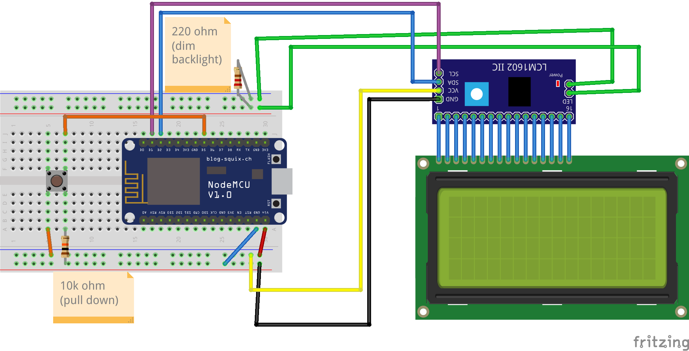

# ESP8266 LCD Weather display

## Wifi connection

## Http request and display data on screen

# Before you start
- Get your i2c address using [i2c Scanner](https://playground.arduino.cc/Main/I2cScanner/), write its result to `i2c_addr` (line 39)
- Set your wifi credentials: `ssid` (line 32), `password` (line 33)
- If you want to change the location, write your city's name in the "q" query parameter from `apiEndpoint` (line 52)

# Libraries used:
- [ArduinoJson 6.18.5](https://arduinojson.org/v6/doc/installation/)
- [New_LiquidCrystal v1.3.5 or v1.5.1](https://web.archive.org/web/20200720122215/https://bitbucket.org/fmalpartida/new-liquidcrystal/downloads/)
- [ESP8266 libraries](https://arduino-esp8266.readthedocs.io/en/latest/installing.html)

# Warning
- I couldn't get ssl fingerprints working, so for now this uses wifi insecure mode.
- Weather data is fake, I use this [weather server](https://github.com/Modulariz/Challenge-Node-Weather) I made last year. 